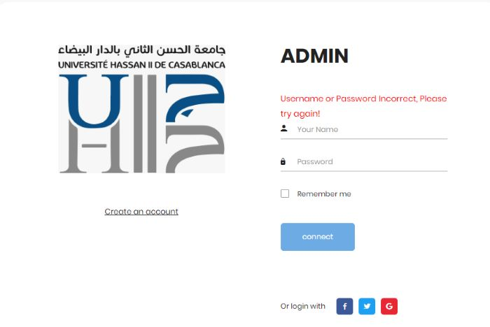
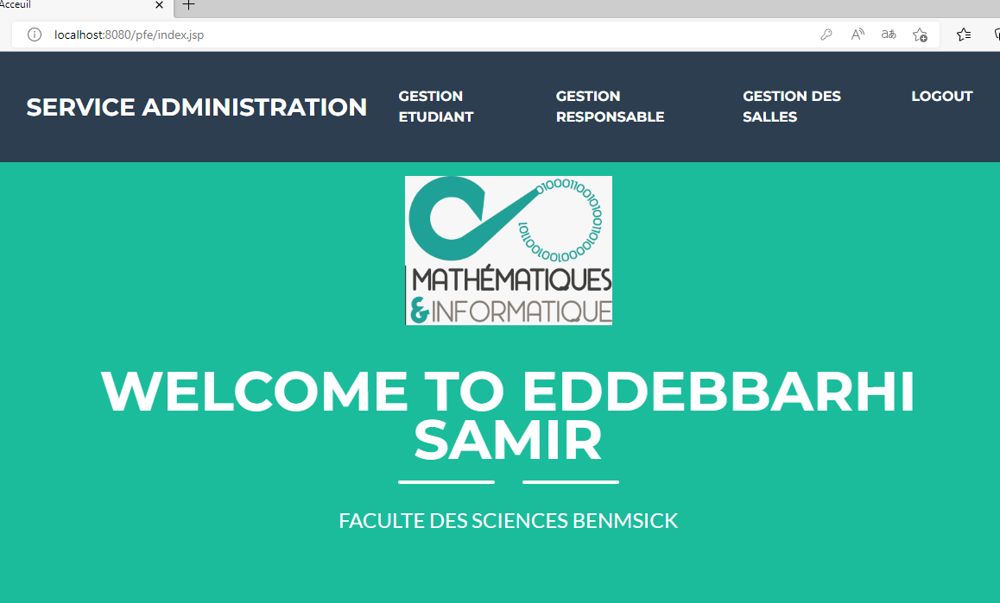
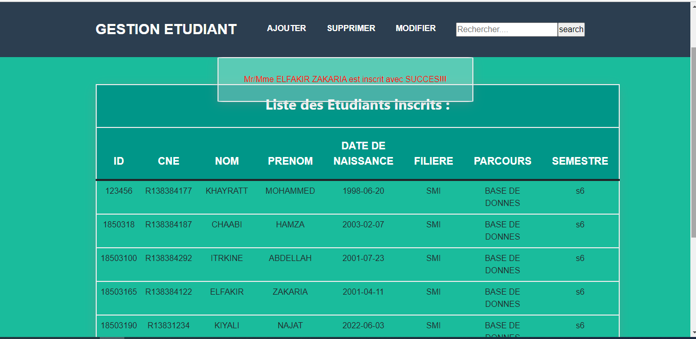
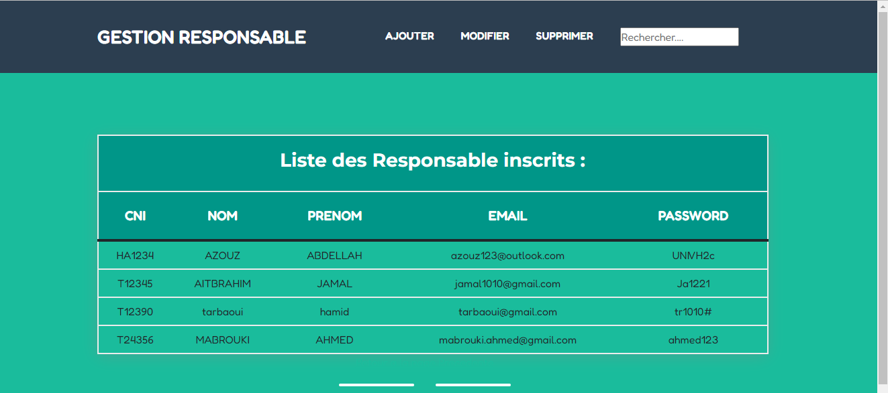

# Student Management attendance in the exams - Final graduate project

## . Presentation:

<ul>
<li>Designed and developed a user-friendly web application for managing student attendance during exams, resulting in a more efficient and streamlined process.. The system consists of a web application for the administrator and the examiner. The students can scan the QR code generated by the examiner to mark their attendance at exams. This system aims to simplify and optimize the attendance process
</li>

</ul>
## 2. Main Technologies:

##### <a href="https://www.java.com/">JAVA EE</a>

##### <a href="https://www.mysql.com/">MySQL</a>

##### <a href="https://www.eclipse.org/">ECLIPSE</a>

## . Some Pictures About this project

1.  
2.  
3.  
4.  

## . Created by:

#### - <a href="https://github.com/Samireddebbarhi">Samir eddebbarhi</a>
